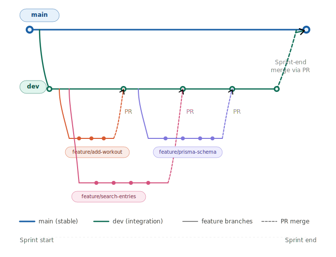

# Git & GitHub Workflow Guide

**CS326 Web Programming**
Phase 2 Team Project -- Spring 2026

---

## 1. Overview

This document defines the Git and GitHub workflow your team will follow throughout the Phase 2 project. The workflow is designed to keep your codebase stable, your collaboration smooth, and your commit history clean. It is modeled after real-world software development practices and is part of your graded assessment under Team Architecture & Git Hygiene (20% of every assignment).

> **The Golden Rule:** No one pushes directly to `main`. Ever. All code reaches `main` through a Pull Request.

## 2. Branch Structure

Your repository uses three types of branches, each with a specific purpose.

| Branch Type   | Naming Convention          | Example                        |
| ------------- | -------------------------- | ------------------------------ |
| Main (stable) | `main`                     | `main`                         |
| Development   | `dev`                      | `dev`                          |
| Task          | `task/<short-description>` | `task/add-workout-form`        |
| Bug fix       | `fix/<short-description>`  | `fix/search-crash-empty-query` |

### 2.1 The `main` Branch

The `main` branch is your project's source of truth. It should always contain stable, working code that could be demonstrated at any time. Code only enters `main` through a Pull Request from `dev` after the team confirms everything works together.

- **Never commit directly to `main`**
- **Never merge untested code into `main`**
- Merge `dev` into `main` at the end of each sprint, after integration testing

### 2.2 The `dev` Branch

The `dev` branch is where all team members' work comes together. Think of it as the team's shared workspace. Individual task branches are merged into `dev` through Pull Requests. When the team is confident that `dev` is stable and all tasks work together, it gets merged into `main`.

- All task branches are created from `dev`
- All Pull Requests target `dev` (not `main`)
- Keep `dev` as clean as possible; fix integration issues promptly

### 2.3 Task Branches

Each team member creates a task branch for every incremental piece of work they do. Task branches are short-lived: they exist only long enough to implement, test, and merge one focused task. Once merged, the branch should be deleted.

**Naming format:** `task/<short-description>`

Use lowercase letters and hyphens. The description should make it obvious what the branch contains and which layer or concern it addresses.

**Good examples:**

- `task/add-workout-form` -- the UI form for a single feature
- `task/add-workout-route` -- the Express route and controller for that feature
- `task/add-workout-service` -- the service and repository layer for that feature
- `task/prisma-entry-schema` -- database schema work

**Bad examples:**

- `task/my-stuff` -- too vague
- `johns-branch` -- not descriptive, missing prefix
- `task/add-workout` -- too broad; this is an entire feature, not one task

## 3. Features vs. Tasks

In this course, each team member is assigned **features** -- user-facing capabilities like "Add Workout" or "Search Entries." A feature spans the entire web stack: form, route, controller, service, repository, and template. Features are large. **You should never implement an entire feature in a single branch.**

Instead, you break each feature into **tasks**. A task is one focused, incremental piece of work toward completing a feature. Each task targets a specific layer or concern, can be tested on its own, and is small enough to review in a single Pull Request. Multiple tasks, merged one at a time into `dev`, come together to form the complete feature.

### 3.1 How to Break a Feature into Tasks

The recommended approach is to split by **layer**. Each task branch handles one layer of the application so that the Pull Request is focused and easy to review.

**Example: Breaking down "Add Workout"**

| Task Branch                | What It Covers                                            |
| -------------------------- | --------------------------------------------------------- |
| `task/add-workout-schema`  | Prisma model and migration for workouts                   |
| `task/add-workout-repo`    | Repository functions for creating and querying workouts   |
| `task/add-workout-service` | Service layer logic and validation                        |
| `task/add-workout-route`   | Express route and controller wiring                       |
| `task/add-workout-form`    | Nunjucks template, HTMX form, and client-side interaction |

Each of these branches is created from `dev`, opened as its own Pull Request, reviewed, and merged independently. By the time all five are merged, the "Add Workout" feature is complete.

### 3.2 How to Scope a Task

Ask yourself these questions before creating a task branch:

- **Does this branch focus on one layer or one concern?** If it touches the template, the route, the service, and the database all at once, it is too big -- split it up.
- **Will the Pull Request be reviewable in under 15 minutes?** If it would take longer, the task probably includes too much.
- **Can this work be tested or verified on its own?** A good task produces something you can point to and say "this part works." For example, you can test a repository function without needing the UI to exist yet.
- **Does this branch contain work that is unrelated to the task name?** If yes, move that work to a separate branch.

### 3.3 Right-Sized vs. Wrong-Sized Tasks

| Size             | Description                                                                              | Example                                                              |
| ---------------- | ---------------------------------------------------------------------------------------- | -------------------------------------------------------------------- |
| Right-Sized Task | One layer or concern for one feature. Independently testable. Reviewable in a single PR. | `task/add-workout-route` -- the route and controller for Add Workout |
| Too Small        | A single-line change or trivial tweak that does not represent a meaningful unit of work. | "Change a button color" or "fix a typo in a comment"                 |
| Too Large        | An entire feature crammed into one branch, or multiple unrelated tasks bundled together. | "Add Workout" end-to-end in one branch, or "workout + search routes" |

### 3.4 When to Create Additional Branches

Sometimes, work within a sprint does not fit neatly into a single feature's tasks. In those cases, create appropriately named branches:

- `task/prisma-schema-setup` -- for shared database schema work that multiple features depend on
- `task/session-middleware` -- for session configuration that all features depend on
- `fix/search-crash-empty-query` -- for fixing a specific bug discovered during integration

## 4. Commit Standards

### 4.1 Commit Message Format

Every commit message must follow this structure:

```
prefix: short description of what changed
```

The prefix indicates the type of change. The description should be a brief, present-tense summary (not past tense). Keep the entire message under 72 characters.

| Prefix      | When to Use                                  | Example                                           |
| ----------- | -------------------------------------------- | ------------------------------------------------- |
| `feat:`     | Adding new functionality                     | `feat: add workout log form with validation`      |
| `fix:`      | Fixing a bug                                 | `fix: resolve crash on empty search query`        |
| `style:`    | CSS/Tailwind styling changes                 | `style: add responsive layout to dashboard`       |
| `refactor:` | Restructuring code without changing behavior | `refactor: extract validation into service layer` |
| `test:`     | Adding or updating tests                     | `test: add SuperTest for POST /entries`           |
| `docs:`     | Documentation changes                        | `docs: update README with setup instructions`     |
| `chore:`    | Config, dependencies, tooling                | `chore: add Prisma schema and initial migration`  |

### 4.2 Writing Good Commit Messages

**Good messages** describe what the commit does and why it matters:

- `feat: add HTMX form submission for new workout log`
- `fix: prevent crash when search query is empty`
- `test: add failure-path test for invalid workout duration`
- `refactor: move validation logic from controller to service layer`

**Bad messages** are vague, lazy, or meaningless:

- `update` -- update what?
- `fixed it` -- fixed what?
- `wip` -- work in progress tells reviewers nothing
- `asdf` -- not even trying
- `final version` -- there is no final version in software

### 4.3 Commit Frequency

Commit early and commit often. A good rule of thumb is to commit every time you complete a small, logical unit of work. You should never go an entire class session without committing.

**Minimum expectations:**

- At least **3--5 commits per task branch** before opening a Pull Request.
- At least **1 commit per class session** during Sprint & Development time.
- Each commit should represent a **single logical change** (not a massive data dump of all your work).

**Think of commits like saving your progress in a game.** You would not play for three hours without saving. Similarly, do not code for an entire sprint without committing. Small, frequent commits make it easy to undo mistakes, trace bugs, and demonstrate your contribution history.

## 5. The Pull Request Workflow

All code must go through a Pull Request (PR) before it is merged into any shared branch. This is a strict requirement.

### 5.1 Step-by-Step: From Task Branch to `dev`

Follow these steps every time you are ready to merge your work.

#### Step 1: Make sure your branch is up to date

Before opening a PR, pull the latest changes from `dev` into your task branch to avoid merge conflicts:

```bash
git checkout dev
git pull origin dev
git checkout task/add-workout-route
git merge dev
```

Resolve any merge conflicts that arise, test that your task still works, and commit the merge.

#### Step 2: Push your branch to GitHub

```bash
git push origin task/add-workout-route
```

#### Step 3: Open a Pull Request on GitHub

- Go to your repository on GitHub.
- Click **"Compare & pull request"** (or go to the Pull Requests tab and click **"New pull request"**).
- Set the **base branch** to `dev` (not `main`).
- Set the **compare branch** to your task branch.
- Write a descriptive title and description.

#### Step 4: PR Title and Description

Your Pull Request title should match your commit message convention:

```
feat: add workout log form with validation
```

Your PR description should include:

- **What this PR does:** A brief summary of the task or fix.
- **How to test it:** Steps a reviewer can follow to verify the task works.
- **Screenshots (if applicable):** For UI changes, include a screenshot or short description of the visual change.

#### Step 5: Request a review

Assign at least one teammate as a reviewer. Do not merge your own Pull Request without a review. The reviewer should check that the code works and follows the project standards (architecture layers, naming conventions, no dead code).

#### Step 6: Address feedback and merge

If the reviewer requests changes, make the fixes on your task branch, commit, and push. The PR will update automatically. Once approved, click the "Merge pull request" button on GitHub. After merging, delete the task branch.

### 5.2 Merging `dev` into `main`

At the end of each sprint (before the Thursday 11:59 PM deadline), the team should merge `dev` into `main`. This should only happen after the team has verified that all merged tasks on `dev` are working together.

- Open a Pull Request from `dev` to `main`.
- Title it with the sprint number (e.g., "Sprint 1: Architecture Foundations").
- Have at least one team member review and approve it.
- Merge the PR.

## 6. Day-to-Day Workflow Summary

Here is the typical workflow you will follow during each class session and sprint.

#### Starting a new task

```bash
git checkout dev
git pull origin dev
git checkout -b task/your-task-name
```

#### Working on your task

```bash
# Make changes to your files
git add .
git commit -m "feat: describe what you just did"
```

Repeat this cycle as you make progress. Commit after each meaningful chunk of work.

#### End of a class session

```bash
git add .
git commit -m "feat: describe current progress"
git push origin task/your-task-name
```

#### Ready to merge

1. Pull latest `dev` into your branch and resolve conflicts.
2. Push your branch.
3. Open a Pull Request targeting `dev`.
4. Request a review from a teammate.
5. Address feedback, then merge.
6. Delete the task branch.

## 7. Common Mistakes to Avoid

- **Pushing directly to `main` or `dev`.** Always use a task branch and a Pull Request. Direct pushes will cost you points.
- **Giant commits.** A single commit titled "added everything" makes it impossible to review your work or track down bugs. Break your work into small, logical commits.
- **Vague commit messages.** Messages like "update," "stuff," or "test" tell your reviewers (and graders) nothing. Use the prefix format.
- **Not pulling before branching.** Always pull the latest `dev` before creating a new task branch. Branching from stale code causes avoidable merge conflicts.
- **Cramming an entire feature into one branch.** Break features into layer-based tasks. Each task gets its own branch. A branch that touches every layer at once is too big to review.
- **Merging without a review.** Every PR needs at least one reviewer. Self-merging defeats the purpose of code review.
- **Leaving dead branches.** After a PR is merged, delete the task branch. Stale branches clutter the repository.

## 8. Quick Reference Card

Keep this handy as a cheat sheet during sprints.

| Action                | Command / Rule                                                            |
| --------------------- | ------------------------------------------------------------------------- |
| Create task branch    | `git checkout -b task/name`                                               |
| Stage and commit      | `git add . && git commit -m "prefix: message"`                            |
| Push branch           | `git push origin task/name`                                               |
| Update from dev       | `git checkout dev && git pull && git checkout task/name && git merge dev` |
| Open a PR             | GitHub website: Compare & pull request                                    |
| PR target for tasks   | Always target `dev`, never `main`                                         |
| Merge `dev` to `main` | End of sprint, via PR, after team testing                                 |
| Commit frequency      | 3--5 commits per task, minimum 1 per class session                        |
| Commit format         | `prefix: short description` (under 72 chars)                              |

## 9. Visual Branch Flow

The diagram below shows how code flows through your branches during a typical sprint.



**Key takeaway:** Code flows upward. Tasks merge into `dev` via Pull Requests. `dev` merges into `main` at the end of each sprint. Nothing bypasses this process.

## 10. Using VS Code with Git and GitHub

Visual Studio Code has built-in Git support and a GitHub extension that lets you do most of the workflow described in this guide without ever opening a terminal. This section walks you through the setup and maps each workflow step to its VS Code equivalent.

### 10.1 Initial Setup

#### Install the required tools

- **Git:** Download and install Git from <https://git-scm.com>. During installation on Windows, accept the defaults. On Mac, Git is included with Xcode Command Line Tools (run `xcode-select --install` in Terminal if needed).
- **VS Code:** Download from <https://code.visualstudio.com>. Git integration is built in and works out of the box.
- **GitHub Pull Requests extension:** Open VS Code, go to the Extensions panel (<kbd>Ctrl+Shift+X</kbd> / <kbd>Cmd+Shift+X</kbd>), search for **"GitHub Pull Requests"**, and install it. This extension lets you create and review Pull Requests directly inside VS Code.

#### Clone your team repository

1. Open VS Code and press <kbd>Ctrl+Shift+P</kbd> / <kbd>Cmd+Shift+P</kbd> to open the Command Palette.
2. Type `Git: Clone` and select it.
3. Paste your team's GitHub repository URL (e.g., `https://github.com/your-team/cs326-project.git`).
4. Choose a local folder to store the project and click **Open** when prompted.

#### Sign in to GitHub

The first time you push or interact with GitHub, VS Code will prompt you to sign in through your browser. Follow the prompts. Once authenticated, VS Code remembers your credentials so you will not be asked again.

### 10.2 The Source Control Panel

The Source Control panel is the heart of Git in VS Code. Open it by clicking the branch icon in the left sidebar or pressing <kbd>Ctrl+Shift+G</kbd> / <kbd>Cmd+Shift+G</kbd>. This panel shows you everything Git-related at a glance.

| What You See                  | What It Means                                                                                                                |
| ----------------------------- | ---------------------------------------------------------------------------------------------------------------------------- |
| Changes section               | Files you have modified, added, or deleted since your last commit.                                                           |
| Staged Changes section        | Files you have explicitly added to the next commit (equivalent to `git add`).                                                |
| Message box at the top        | Where you type your commit message before committing.                                                                        |
| Branch name in the status bar | The bottom-left corner shows your current branch. Click it to switch branches.                                               |
| Sync Changes button           | Pushes your local commits to GitHub and pulls any new changes from your teammates (equivalent to `git push` and `git pull`). |

### 10.3 Daily Workflow in VS Code

Here is how each step of the workflow from Section 6 translates into VS Code actions.

#### Switch to the `dev` branch and pull latest changes

1. Click the branch name in the bottom-left corner of VS Code (it might say `main` or your current task branch).
2. Select `dev` from the dropdown list.
3. Open the Command Palette (<kbd>Ctrl+Shift+P</kbd> / <kbd>Cmd+Shift+P</kbd>) and type `Git: Pull`. Select it to pull the latest changes from your teammates.

#### Create a new task branch

1. Click the branch name in the bottom-left corner.
2. Select **"Create new branch from..."**.
3. Type your branch name following the naming convention (e.g., `task/add-workout-form`).
4. When asked which branch to create from, select `dev`.

VS Code automatically switches you to the new branch.

#### Stage and commit your changes

1. Open the Source Control panel (<kbd>Ctrl+Shift+G</kbd> / <kbd>Cmd+Shift+G</kbd>).
2. You will see your changed files listed under "Changes." Click the **+** icon next to each file to stage it, or click the **+** next to "Changes" to stage everything.
3. Type your commit message in the text box at the top using the standard format (e.g., `feat: add workout log form with validation`).
4. Click the **Commit** button (the checkmark icon) or press <kbd>Ctrl+Enter</kbd> / <kbd>Cmd+Enter</kbd>.

#### Push your branch to GitHub

After committing, click the **Sync Changes** button in the Source Control panel, or use the Command Palette and type `Git: Push`. If this is the first push for a new branch, VS Code will ask if you want to publish the branch. Click **OK**.

#### Pull changes from `dev` into your task branch

Before opening a Pull Request, you need to make sure your branch includes the latest work from your teammates.

1. Open the VS Code terminal (<kbd>Ctrl+`</kbd>) and run:

   ```bash
   git merge dev
   ```

2. If there are merge conflicts, VS Code highlights them directly in the editor with colored markers ("Accept Current Change," "Accept Incoming Change," or "Accept Both Changes"). Resolve each conflict, then stage and commit the result.

### 10.4 Creating a Pull Request from VS Code

With the GitHub Pull Requests extension installed, you can create PRs without leaving VS Code.

1. After pushing your task branch, open the Command Palette and type `GitHub Pull Requests: Create Pull Request`.
2. A PR creation form appears inside VS Code. Set the **base branch** to `dev` and the **compare branch** to your task branch.
3. Write a descriptive title and description following the format from Section 5.4.
4. Click **Create**.

You can also review Pull Requests from teammates directly in VS Code. The GitHub Pull Requests panel in the left sidebar shows all open PRs. Click one to see the changes, leave comments, and approve or request changes.

### 10.5 Useful VS Code Shortcuts

| Action                        | Shortcut                                                         |
| ----------------------------- | ---------------------------------------------------------------- |
| Open Source Control panel     | <kbd>Ctrl+Shift+G</kbd> / <kbd>Cmd+Shift+G</kbd>                 |
| Open Command Palette          | <kbd>Ctrl+Shift+P</kbd> / <kbd>Cmd+Shift+P</kbd>                 |
| Open integrated terminal      | <kbd>Ctrl+\`</kbd> / <kbd>Cmd+\`</kbd>                           |
| Commit staged changes         | <kbd>Ctrl+Enter</kbd> / <kbd>Cmd+Enter</kbd> (in Source Control) |
| Switch branches               | Click branch name in bottom-left status bar                      |
| View file diff (what changed) | Click any file in the Source Control panel                       |
| View Git log / history        | Command Palette → `Git: View History`                            |

### 10.6 VS Code Tips for This Project

- **Always check the bottom-left corner.** The branch name displayed there tells you exactly where your commits will go. If it says `main`, stop and switch to your task branch before making changes.
- **Use the built-in diff viewer.** When you click a changed file in the Source Control panel, VS Code shows a side-by-side comparison of what changed. This is helpful before committing to make sure you are not including anything unintended.
- **Use the integrated terminal when you need to.** The VS Code GUI covers most Git operations, but some tasks (like merging `dev` into your branch, or resolving complex conflicts) are easier in the terminal. Press <kbd>Ctrl+`</kbd> / <kbd>Cmd+`</kbd> to open it without leaving VS Code.
- **Install GitLens (optional but recommended).** The GitLens extension adds inline blame annotations, a visual commit graph, and richer history views. Search for "GitLens" in the Extensions panel. It is free and widely used in the industry.
- **Do not use the "auto-fetch" feature to push to `main`.** VS Code may offer to sync changes automatically. This is fine for your task branch, but remember: `main` is only updated through Pull Requests on GitHub, never by pushing directly.

### 10.7 Terminal vs. VS Code GUI: When to Use Which

| Use the VS Code GUI for              | Use the terminal for                                          |
| ------------------------------------ | ------------------------------------------------------------- |
| Staging and committing files         | Merging branches (`git merge dev`)                            |
| Switching branches                   | Resolving complex merge conflicts                             |
| Pushing and pulling                  | Resetting or undoing mistakes (`git reset`, `git stash`)      |
| Viewing diffs and change history     | Checking branch status (`git status`, `git log --oneline`)    |
| Creating and reviewing Pull Requests | Any operation where you want to see exactly what Git is doing |

The terminal and the GUI are doing the same thing under the hood. Use whichever feels more comfortable for the task at hand. Many professional developers use both interchangeably.

See [Source Control in VS Code](https://code.visualstudio.com/docs/sourcecontrol/overview) for more details.
